# a2i2-fig-styles

Acknowledgment: This package is built on top of the excellent SciencePlots work by John Garrett and contributors.

`a2i2-fig-styles` provides publication-ready Matplotlib style presets for:
- `a2i2`
- `acl`, `kdd`, `icdm`, `neurips`
- `1col` and `2col` layouts
- figure types: `line`, `bar`, `scatter`, `heatmap`, `image-grid`, `text-equation`

## Install

```bash
pip install -e .
```

## Quick Start

```python
import matplotlib.pyplot as plt
import scienceplots

plt.style.use(["science", "neurips-1col-line", "no-latex"])
plt.plot([0, 1, 2], [0.2, 0.7, 0.9])
plt.xlabel("Epoch")
plt.ylabel("Score")
plt.show()
```

For `a2i2`:

```python
import matplotlib.pyplot as plt
import scienceplots

plt.style.use(["a2i2", "no-latex"])
```

## Preset API

```python
from scienceplots import get_preset, resolve_preset_name, style_stack

preset = get_preset("neurips", "1col", "line")
print(preset["name"], preset["figsize"])  # neurips-1col-line, (3.25, 2.3)

print(resolve_preset_name("nips_line_1col"))  # neurips-1col-line

styles = style_stack("acl", "2col", "image-grid", no_latex=True)
```

## Generate Example Figures

Run all example scripts:

```bash
PYTHONPATH=src python3 examples/plot-a2i2-examples.py
PYTHONPATH=src python3 examples/plot-conference-presets.py
PYTHONPATH=src python3 examples/plot-all-preset-gallery.py
```

Outputs are saved in `examples/figures/`.

## Rendered Examples

### A2I2

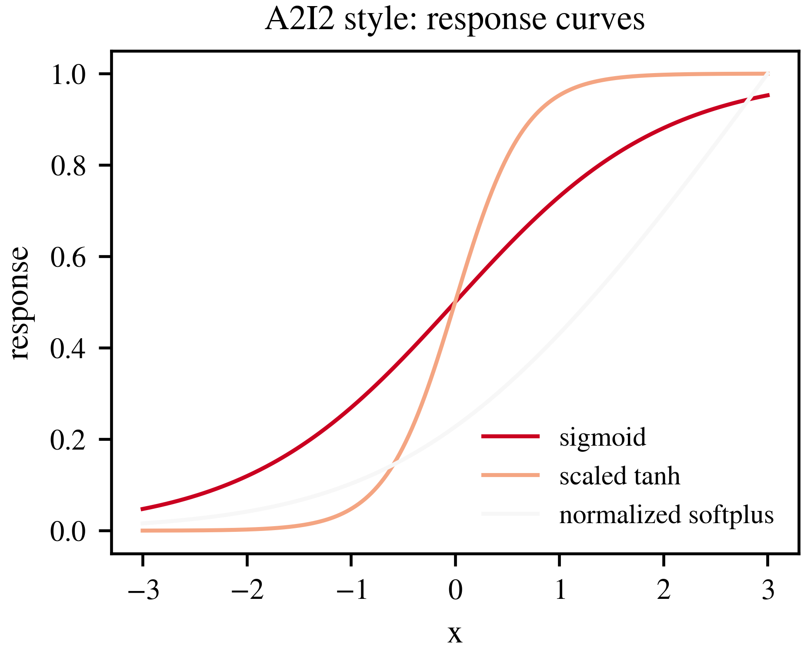
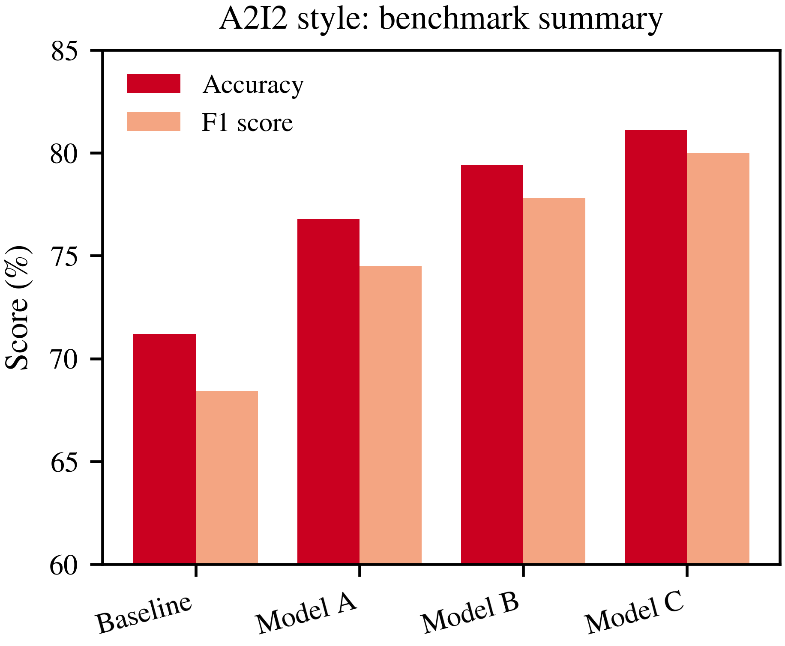

### Conference Presets

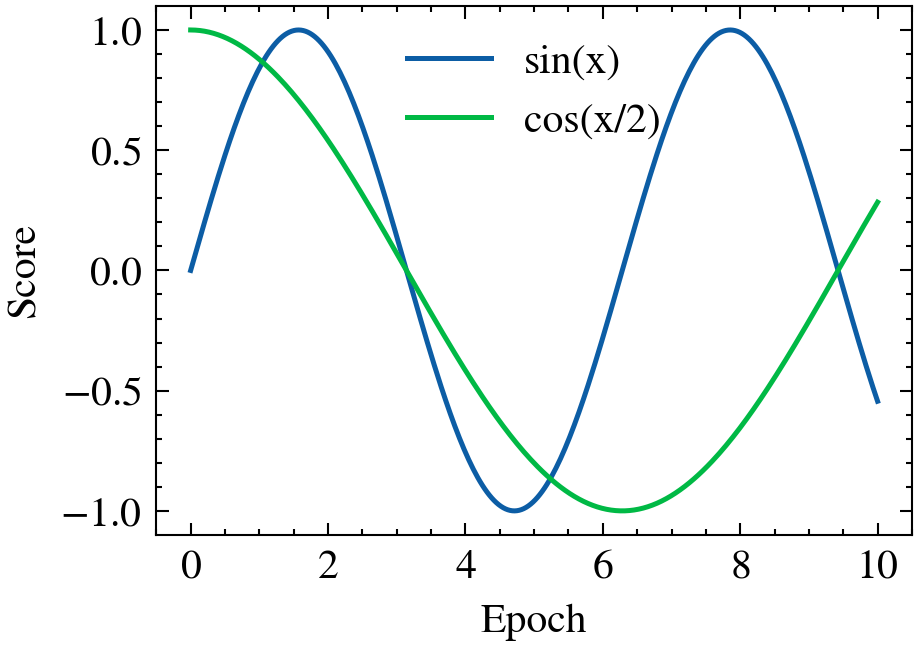
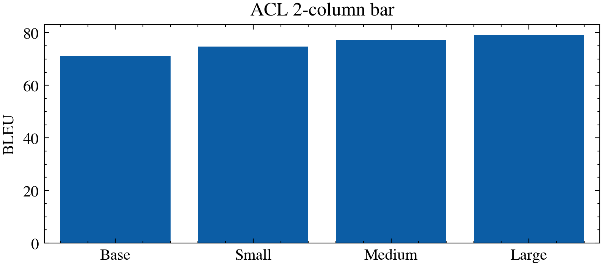
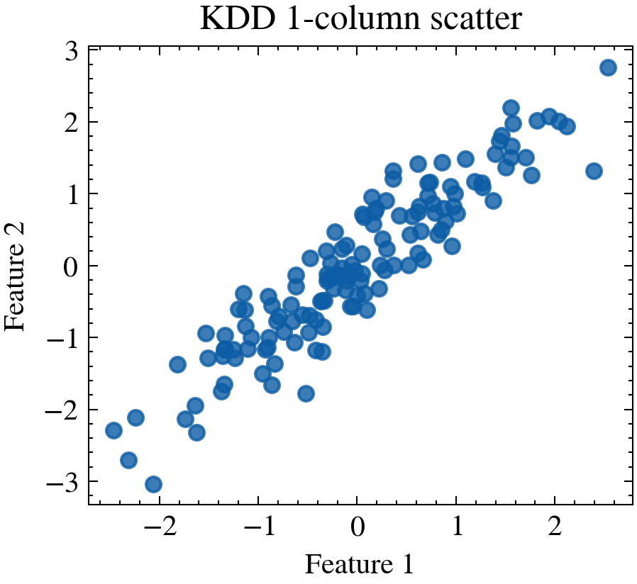
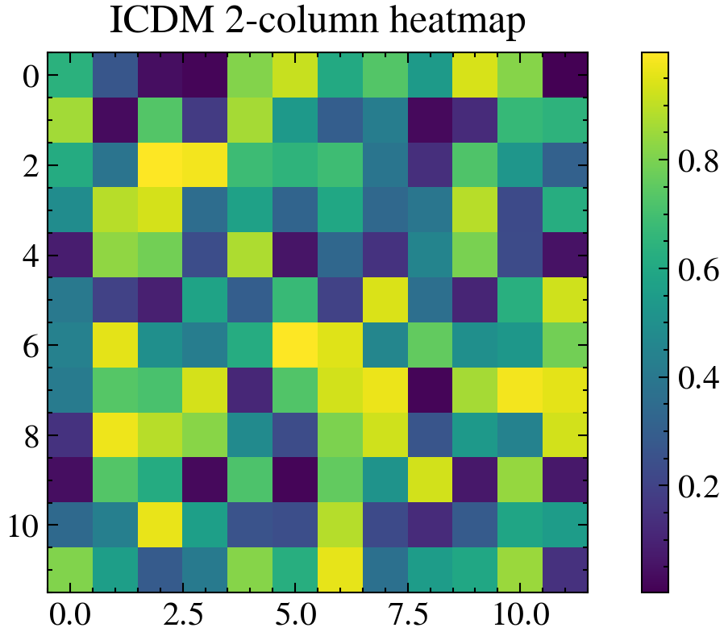
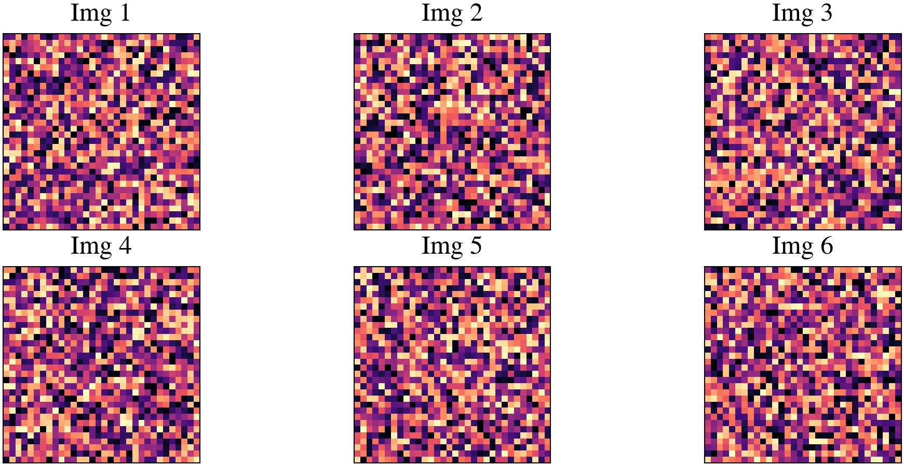
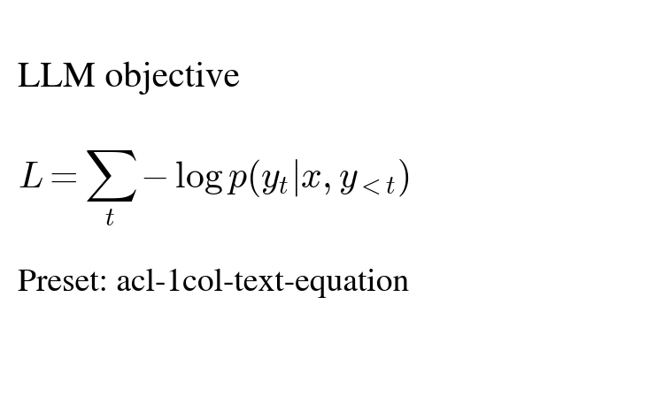

### Full Style Catalog Samples

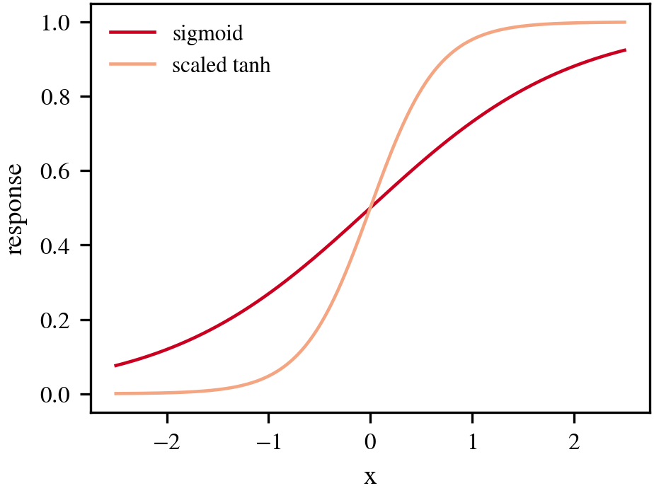
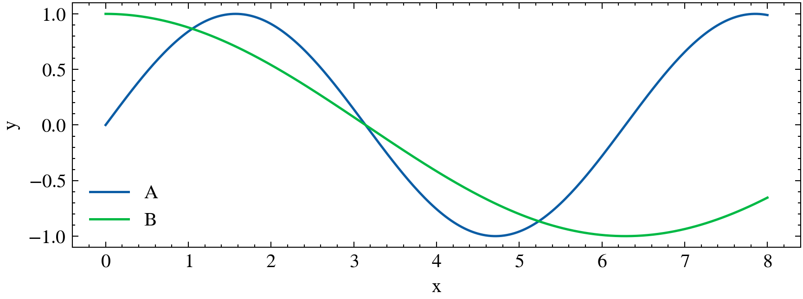
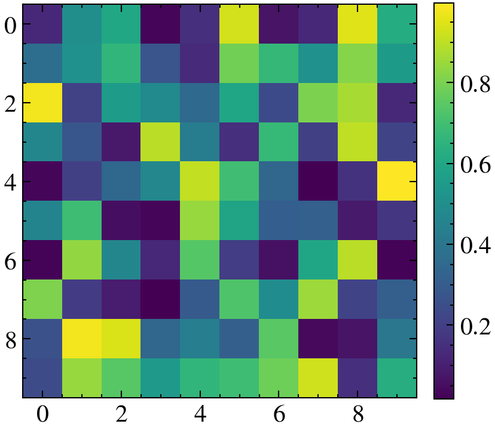
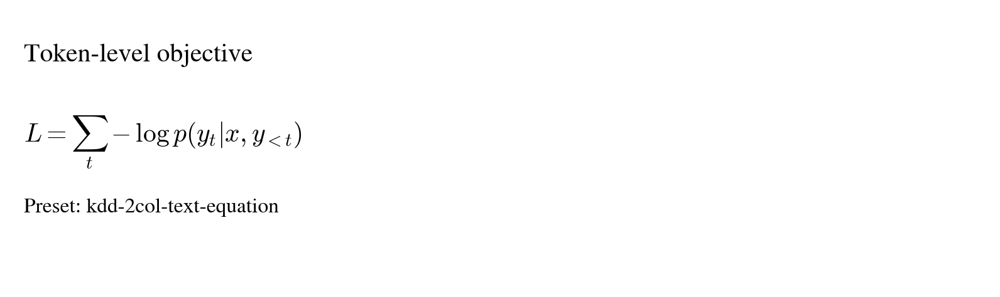

## Common Use Cases

- LLM training curves: `neurips-1col-line`, `acl-1col-line`
- CV/vision panels: `neurips-2col-image-grid`, `icdm-2col-image-grid`
- Benchmark comparison bars: `kdd-2col-bar`, `acl-2col-bar`
- Confusion matrix/attention map: `neurips-1col-heatmap`, `icdm-1col-heatmap`
- Equation-heavy explanatory figures: `acl-1col-text-equation`, `kdd-1col-text-equation`

## Test

```bash
python3 -m pytest -q
```
